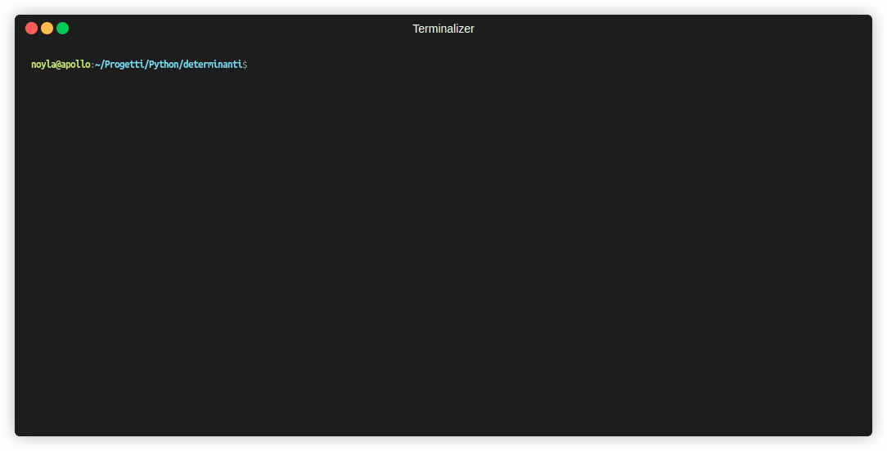

# Determinants



A Python CLI application that calculates the determinant of square matrices of any dimension. It uses a hybrid approach: direct closed-form formulas for lower orders ($N \le 3$) and recursive Laplace expansion for higher-order matrices ($N \ge 4$).

> **Note:** The CLI interface and user prompts are currently in **Italian**.

## Mathematical Algorithms

The program dynamically routes the calculation based on the dimension $N$ of the matrix using Python 3.10's `match/case` pattern.

### 1. Order 1 ($1 \times 1$)
For a single-element matrix $A = [a_{11}]$, the determinant is trivially the element itself:

$$\det(A) = a_{11}$$

### 2. Order 2 ($2 \times 2$)
Calculated directly via the difference between the main and secondary diagonal products (`metodo_diagonale`):

$$A = \begin{pmatrix} a_{11} & a_{12} \\ a_{21} & a_{22} \end{pmatrix}$$

$$\det(A) = a_{11}a_{22} - a_{12}a_{21}$$

### 3. Order 3 ($3 \times 3$) – Sarrus' Rule
For $3 \times 3$ matrices, the application uses **Sarrus' Rule** (`metodo_sarrus`):

$$A = \begin{pmatrix} a_{11} & a_{12} & a_{13} \\ a_{21} & a_{22} & a_{23} \\ a_{31} & a_{32} & a_{33} \end{pmatrix}$$

The determinant is calculated by summing the products of the three main diagonals and subtracting the products of the three secondary diagonals:

$$\det(A) = (a_{11}a_{22}a_{33} + a_{12}a_{23}a_{31} + a_{13}a_{21}a_{32}) - (a_{13}a_{22}a_{31} + a_{11}a_{23}a_{32} + a_{12}a_{21}a_{33})$$

### 4. Order $N \ge 4$ – Laplace Expansion (Recursive)
For larger matrices, the program performs **Laplace Expansion** (`metodo_laplace`) along the first row ($r = 0$):

$$\det(A) = \sum_{j=1}^{N} (-1)^{1+j} \cdot a_{1j} \cdot \det(M_{1j})$$

* **Minor Submatrices ($M_{1j}$)**: For each element $a_{1j}$ in the first row, a new submatrix of order $(N-1) \times (N-1)$ is constructed by removing row $1$ and column $j$.
* **Cofactor Sign**: The sign $(-1)^{1+j}$ alternates based on element coordinate parity (`is_posizizone_pari`).
* **Recursion Base Case**: Submatrices are recursively evaluated through `calcolo_determinante` until they hit base cases ($N \le 3$), avoiding unnecessary decomposition down to $1 \times 1$.

## Performance & Complexity

* **Time Complexity**: $O(N!)$ due to recursive submatrix branching in Laplace expansion.
* **Space Complexity**: $O(N^2)$ stack allocation for submatrix slicing during execution.

*Note: The program handles matrices up to $10 \times 10$ rapidly. Larger dimensions (e.g. $11 \times 11$) will require noticeable processing time due to factorial expansion.*

## Project Structure

```
├── main.py       # Core logic, Laplace recursion, and matrix validation
├── input.py      # Terminal input parsing and row dimension checking
├── output.py     # Terminal UI rendering using Rich (Tables & Panels)
└── determinanti.gif
```

## Requirements & Usage

Requires **Python 3.10+** and the `rich` library.

1. **Install dependencies:**
   `pip install rich`
2. **Run the program:**
   `python main.py`
